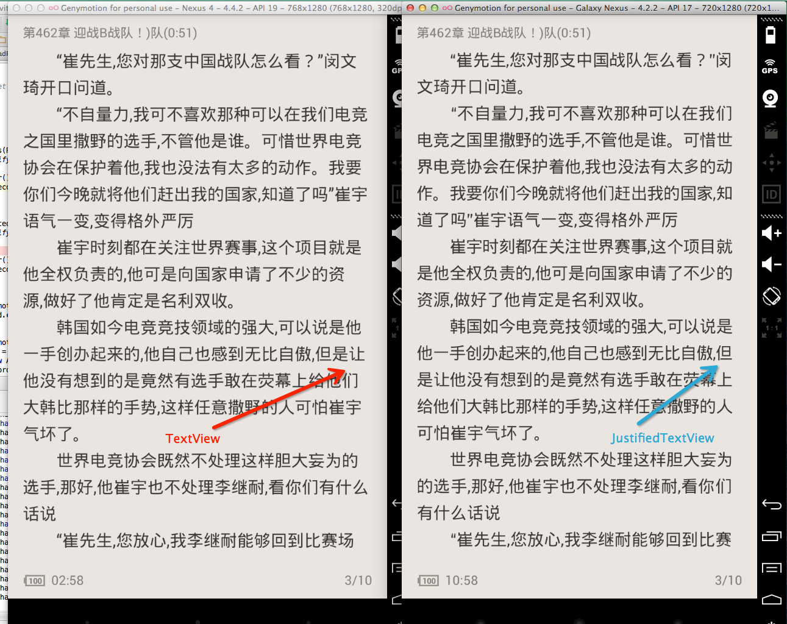

#JustifiedTextView

Implement justified textview base on the native TextView. Let text displays fill the screen width without extra blanks in the end of line. 



##Usage

You can import in build.gradle like this

    compile 'me.biubiubiu.justifytext:library:1.0.0'

If you use maven, add this to pom.xml.

    <dependency>
      <groupId>me.biubiubiu.justifytext</groupId>
      <artifactId>library</artifactId>
      <version>1.0.0</version>
      <type>aar</type>
    </dependency>

Then add put this into layout file.

```xml
    <me.biubiubiu.justifytext.library.JustifyTextView
        android:id="@+id/text"
        android:layout_width="match_parent"
        android:layout_height="wrap_content"
        />
```

##demo

<a href="https://play.google.com/store/apps/details?id=me.biubiubiu.justifytext">
  
</a>


