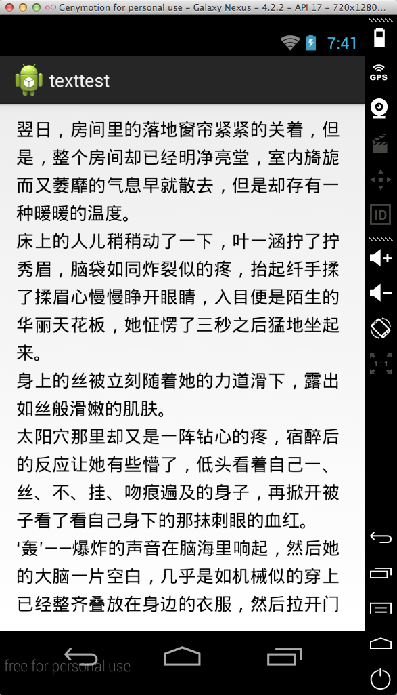

#截图



#实现方法

用android原生的widget实现两端对齐,让你的textview不在坑坑洼洼。

#使用方法

```xml
    <me.biubiubiu.justifytext.library.JustifyTextView
        android:id="@+id/text"
        android:layout_width="match_parent"
        android:layout_height="wrap_content"
        />
```

#demo

<a href="https://play.google.com/store/apps/details?id=me.biubiubiu.justifytext">
  
</a>


